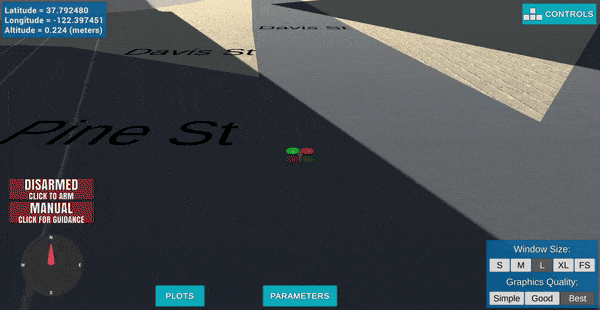
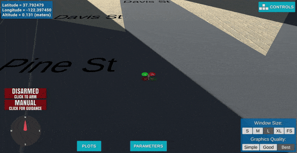

# Udacity Flying Car Nanodegree #
# Project 2: 3D Motion Planning #

## Description ##

## Rubric Criteria: Explain the Starter Code ##

### 1. Test that `motion_planning.py` is a modified version of `backyard_flyer_solution.py` for simple path planning. Verify that both scripts work. Then, compare them side by side and describe in words how each of the modifications implemented in `motion_planning.py` is functioning. ###

Both `backyard_flyer_solution.py` and `motion_planning.py` are fully functional. Here they are in action:





As you can see, `backyard_flyer.py` flies the drone in a square pattern at 10m per side and 3m altitude, while `motion_planning` appears to fly the drone betwene a succession of waypoints in a single line.

Upon comparison of the files themselves, we see they have very similar structure across many functions such as `local_position_callback()` and `velocity_callback()`. However, the differences begin in their `state_callback()` function, where we see a `plan_path()` function being called and a new `PLANNING` state:

```sh
# backyard_flyer_solution.py

    def state_callback(self):
        if self.in_mission:
            if self.flight_state == States.MANUAL:
                self.arming_transition()
            elif self.flight_state == States.ARMING:
                if self.armed:
                    self.takeoff_transition()
            elif self.flight_state == States.DISARMING:
                if ~self.armed & ~self.guided:
                    self.manual_transition()

```

```sh
# motion_planning.py

    def state_callback(self):
        if self.in_mission:
            if self.flight_state == States.MANUAL:
                self.arming_transition()
            elif self.flight_state == States.ARMING:
                if self.armed:
                    self.plan_path()
            elif self.flight_state == States.PLANNING:
                self.takeoff_transition()
            elif self.flight_state == States.DISARMING:
                if ~self.armed & ~self.guided:
                    self.manual_transition()
```

The `plan_path()` function is very involved, and performs the following actions:

1) Loads data from a spreadsheet to represent obstacles.
2) Takes obstacle data and creates a grid map using `create_grid()` from `planning_utils.py` which represents safe areas to fly.
3) Establishes start and goal points.
4) Uses the A* algorithm from the `planning_utils.py` file to find a path between these points.
5) Creates a set of waypoints found from the algorithm.
6) Sends these waypoints to the simulator using the `send_waypoints()` function and graphs them.
7) Moves the quad between each point in succession.

In contrast, `backyard_flyer_solution.py` only calls the `calculate_box()` method, which establishes the static points corresponding to a 10x10 grid at 3m of altitude. The files are almost identical in all later respects of landing and disarming.

Examining `planning_utils.py` further, the grid is created by reading in csv data within `motion_planning.py`, then feeding it into the previous script, where it is transformed into a matrix using the map dimensions where flyable space is denoted by a value of 0 at a particular grid spot, and obstacle space is denoted by a 1 if its height plus the safety distance is higher than the drone altitude, or is within the extent of the obstacle plus the safety distance.

The A* algorithm is more complex. It first uses a set of predefined actions (NSEW) and a function for finding valid actions using grid values, and establishes a queue of actions to consider which total movement costs along the lowest-cost path that solves the start-to-goal movement of the drone. The lowest cost path is complete once the queue is empty and then returned to the quad - otherwise, an error is printed.


### 2. In the starter code, we assume that the home position is where the drone first initializes, but in reality you need to be able to start planning from anywhere. Modify your code to read the global home location from the first line of the `colliders.csv` file and set that position as global home (`self.set_home_position()`) ###

This was done within the following lines of code taken from the beginning of the `plan_path()` function:

```sh
    # DONE: read lat0, lon0 from colliders into floating point values
    csvfile = open('colliders.csv', newline='')
    reader = csv.reader(csvfile)
    latLonLine = next(reader)
    lat0 = np.float(latLonLine[0][5:])
    lon0 = np.float(latLonLine[1][5:])
    
    # DONE: set home position to (lon0, lat0, 0)
    self.set_home_position(lon0, lat0, 0)
```

### 3. In the starter code, we assume the drone takes off from map center, but you'll need to be able to takeoff from anywhere. Retrieve your current position in geodetic coordinates from `self._latitude`, `self._longitude` and `self._altitude`. Then use the utility function `global_to_local()` to convert to local position (using `self.global_home` as well, which you just set) ###

The local position relative to global home was found by doing the following in `plan_path()`:

```sh
    # DONE: retrieve current global position
    latCurr = self._latitude
    lonCurr = self._longitude
    altCurr = self._altitude

    # DONE: convert to current local position using global_to_local()
    local_coordinates_NED = global_to_local(np.array((lonCurr,latCurr,altCurr)), self.global_home)
```


### 4. In the starter code, the `start` point for planning is hardcoded as map center. Change this to be your current local position. ###

Again, this was done by making the following adjustment to `plan_path()`:

```sh
    # DONE: convert start position to current position rather than map center
    grid_start = (np.int(np.around(local_coordinates_NED[0] - north_offset)), np.int(np.around(local_coordinates_NED[1] - east_offset)))
```

### 5. In the starter code, the goal position is hardcoded as some location 10 m north and 10 m east of map center. Modify this to be set as some arbitrary position on the grid given any geodetic coordinates (latitude, longitude) ###

This part was interesting. Originally, I had mistaken the problem as asking us to solve for any arbitrary latitude and longitude in the world. Quickly discovering that A* has a limited range of capability based on processing power and/or simulator size, I decided to instead cast these random coordinates on the grid boundary should they lie outside of the map (which is all but certain).

The following is the result, which still is able to take any latitude and longitude within the map and work with it:

```sh
    # Determines random coordinates for latitude and longitude and converts them to grid destinations

    # Determine two random floats in the interval [0, 1)
    randomFloats = np.random.random_sample((2,))
    # Convert 1st float to a latitude range of (0, 90)
    randomLat = np.float(randomFloats[0]*90.)
    # Convert 2nd float to a longitude range of (0, 180)
    randomLon = np.float(randomFloats[1]*180.)

    # # minimum and maximum north coordinates
    north_min = np.floor(np.min(data[:, 0] - data[:, 3]))
    north_max = np.ceil(np.max(data[:, 0] + data[:, 3]))

    # minimum and maximum east coordinates
    east_min = np.floor(np.min(data[:, 1] - data[:, 4]))
    east_max = np.ceil(np.max(data[:, 1] + data[:, 4]))

    # use scipy to do interpolation for us and convert lat to north, lon to east

    lat_to_north = interp1d([0, 90], [1, 919])
    lon_to_east = interp1d([0, 180], [1, 919])
    randomNorth = lat_to_north(randomLat)
    randomEast = lon_to_east(randomLon)

    # use ratios of north to east to find actual boundary coordinates for random latitudes & longitudes

    if randomNorth > randomEast:
        ratio = randomEast / randomNorth
        randomNorth = 919
        randomEast = randomNorth * ratio
    else:
        ratio = randomNorth / randomEast
        randomEast = 919
        randomNorth = randomEast * ratio

    # new grid_goal as an array of ints
    grid_goal = np.array((np.int(randomNorth),np.int(randomEast)))
    # recast grid_goal as a tuple
    grid_goal = (int(grid_goal[0]), int(grid_goal[1]))
```


### 6. Write your search algorithm. Minimum requirement here is to add diagonal motions to the A* implementation provided, and assign them a cost of sqrt(2). However, you're encouraged to get creative and try other methods from the lessons and beyond! ###

To incorporate actions of cost sqrt(2), both the individual actions themselves were added to the `Action` class, and more conditions for removing diagonal actions based on grid value after the proposed movement were added in the `valid_actions()` function:

```sh
class Action (Enum):
	
	...

    WEST = (0, -1, 1)
    EAST = (0, 1, 1)
    NORTH = (-1, 0, 1)
    SOUTH = (1, 0, 1)
    NORTHEAST = (-1, 1, np.sqrt(2))
    SOUTHEAST = (1, 1, np.sqrt(2))
    SOUTHWEST = (1, -1, np.sqrt(2))
    NORTHWEST = (-1, -1, np.sqrt(2))

    ...

```

```sh
def valid_actions(grid, current_node):

	...

	# Old action removals

	if x - 1 < 0 or grid[x - 1, y] == 1:
        valid_actions.remove(Action.NORTH)
    if x + 1 > n or grid[x + 1, y] == 1:
        valid_actions.remove(Action.SOUTH)
    if y - 1 < 0 or grid[x, y - 1] == 1:
        valid_actions.remove(Action.WEST)
    if y + 1 > m or grid[x, y + 1] == 1:
        valid_actions.remove(Action.EAST)

 	# New action removals for moving illegally diagonally

    if x - 1 < 0 or y - 1 < 0 or grid[x - 1, y - 1] == 1:
        valid_actions.remove(Action.NORTHWEST)
    if x - 1 < 0 or y + 1 > m or grid[x - 1, y + 1] == 1:
        valid_actions.remove(Action.NORTHEAST)
    if x + 1 > n or y - 1 < 0 or grid[x + 1, y - 1] == 1:
        valid_actions.remove(Action.SOUTHWEST)
    if x + 1 > n or y + 1 > m or grid[x + 1, y + 1] == 1:
        valid_actions.remove(Action.SOUTHEAST)

    ...

```

One minor change to the A* algorithm was made in order to properly account for the heuristic cost, which mysteriously would not have had an effect in the `planning_utils().py` script as provided. This is commented and snipped below:

```sh
    while not queue.empty():
        item = queue.get()
        current_node = item[1]
        if current_node == start:
            current_cost = 0.0
        else:              
            current_cost = item[0] # original version has branch[current_node][0], foregoing the heuristic function...
```

It could have also been incorporated here instead, further down in the `a_star()` function, but I opted for the first possibility:
```sh
    if next_node not in visited:                
        visited.add(next_node)               
        branch[next_node] = (branch_cost, current_node, action) 
        # original queue.put() call has branch_cost instead of queue_cost, which includes the heuristic...
        queue.put((queue_cost, next_node))
```

Now the heuristic function is properly accounted for instead of apparently being entirely bypassed.


### 7. Cull waypoints from the path you determine using search. ###

Waypoints were culled by performing collinearity checks in conjunction with a `prune_path()` function:

```sh
    # Recast point in array form
    def point(p):
        return np.array([p[0], p[1], 1.]).reshape(1, -1)
    # Check if three points are collinear.
    # NOTE: Adjust epsilon if path cuts into obstacles
    def collinearity_check(p1, p2, p3, epsilon=7):#1e-6):
        p1 = point(p1)
        p2 = point(p2)
        p3 = point(p3)
        m = np.concatenate((p1, p2, p3), 0)
        det = np.linalg.det(m)
        return abs(det) < epsilon
    # Prune a path of points by removing middle ones alongst lines
    def prune_path(path):
        pruned_path = [p for p in path]            
        idx = 0
        while idx < len(pruned_path) - 2:
            if collinearity_check(pruned_path[idx], pruned_path[idx+1], pruned_path[idx+2]):
                pruned_path.remove(pruned_path[idx+1])
            else:
                idx += 1
        return pruned_path

    path = prune_path(path)
```

## Rubric Criteria: Executing the flight ##

### 8. This is simply a check on whether it all worked. Send the waypoints and the autopilot should fly you from start to goal! ###

Here's a sample of a flight below!

